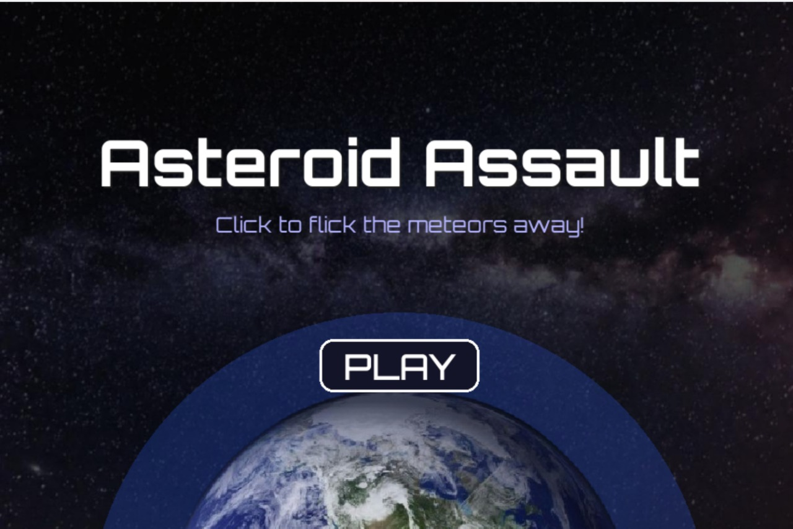

# **🌌 Meteor Madness- NASA Space Apps 2025**


## 🚀Challenge Overview


**Event:** 2025 NASA Space Apps Challenge


**Difficulty:** Beginner/Youth, Intermediate, Advanced


**Subjects:** Astrophysics, Coding, Data Analysis, Disaster Response, Space Exploration, Statistics


NASA’s challenge:

> A newly identified near-Earth asteroid, *Impactor-2025*, poses a potential threat to Earth. Develop an interactive visualization and simulation tool that integrates NASA and USGS datasets, allowing users to model asteroid impact scenarios, predict consequences, and explore mitigation strategies.


Our solution: **Meteor Madness** – an engaging, educational, and scientifically informed platform to explore asteroid impacts and defend Earth in real-time.


---


## 🎯 **Objectives**


- Enable users to **simulate asteroid impacts** using size, velocity, angle, and material inputs


- Calculate **impact energy, crater size, and environmental effects**


- Provide **interactive visualizations** with Pygame arcade gameplay


---


## 🎮 Features


### **1. Streamlit Main Menu** (Hub)


- One-click access to both **Game Mode** and **Exploration Mode**


- Launch Pygame locally or Exploration Mode in browser


- Visually appealing with logo and instructions


---


### 2. Game Mode (Arcade)


- Flick meteors away to protect Earth


- Dynamic asteroid spawning with increasing difficulty


- Explosions, score tracking, and game-over mechanics





---


### 3. Exploration Mode (Simulation)


- Input asteroid parameters: **diameter, velocity, impact angle, material, location**


- Calculates **mass, effective energy, and estimated crater size**


- Shows **potential risks and environmental effects** (tsunamis, fires, shockwaves)


- Designed with **neon-themed interface** for an engaging user experience


---


## ⚙️ How to Run

### **Prerequisites**
- **Python (3.10 or 3.11)** installed: [Download Python](https://www.python.org/downloads/)  
  Make sure to check **“Add Python to PATH”** during installation.  
- **pip** (comes with Python, installed with Python)  
- **Optional but recommended:** a virtual environment to avoid package conflicts

---

### **Step 1: Get the Project Files**

You can get the files in **two ways**: using Git or a ZIP download.

#### **Option A: Download ZIP (No Git Needed)**

1. Go to the GitHub repository
2. Click the **Code** button (green) → Select **Download ZIP**.  
3. Save the ZIP file to a folder on your computer .
4. **Extract the ZIP**:  
   - **Windows:** Right-click → Extract All → Choose a folder 
   - **macOS:** Double-click the ZIP → It creates a folder with the project files  
   - **Linux:** Right-click → Extract Here, or use `unzip Meteor_Madness.zip` in terminal  


⚠️ **Note:** After extraction, you might see a folder inside another folder like  
`Meteor_Madness-main/Meteor_Madness-main/`  
Make sure you open the *inner* folder — the one that contains files like:  
`main_menu.py`, `requirements.txt`, and the `assets` folder.


#### **Option B: Use Git (If Installed)**

If you have Git installed, open a terminal / command prompt:

```bash
git clone https://github.com/Blehbleh77/Meteor_Madness.git
cd Meteor_Madness
```


### **Step 2: Install Required Packages**

1. Open Command Prompt
2. Change directory to the folder with the requirements.txt file

```bash
pip install -r requirements.txt
```

### **Step 3: Run the Streamlit main menu:**

Run this command in the same terminal:

```bash
python -m streamlit run main_menu.py
```

If that doesn’t work, try this alternative:

```bash
python -m streamlit run main_menu.py
```

---


## 📊 Technical Details


- **Languages & Libraries:** Python, Pygame, Streamlit, NumPy


- **Physics & Calculations:**

  
  - Kinetic energy and mass based on asteroid size & material


  - Crater diameter scaling and angle effects


  - Environmental risk modeling (land/ocean, shallow/steep impacts)


- **Assets:** Fonts, images, and UI effects for immersive gameplay


- **Modular Design:** Easily extendable for new modes, asteroid types, or datasets


---


## 🏆 Standout Features


- **Gamification:** Arcade mode and interactive exploration

- **Educational Overlays:** Tooltips and explanations of physics concepts

- **Neon Visuals:** Sci-fi themed interface for engagement

- **Expandable Framework:** Ready for real NASA & USGS dataset integration

- **Accessibility & Engagement:** Easy-to-use hub for all audiences


---


## 📂 Submission Notes


- Assets folder must remain in the same directory as Python files


- Package Game Mode and Exploration Mode as executables with PyInstaller


## 🔮 Future Work


- Integrate real NASA NEO API data for asteroid trajectories

- Model deflection strategies like kinetic impactors or gravity tractors

- Add 3D visualizations of impact zones and orbital paths

- Web-based deployment via Streamlit Cloud for public accessibility


## 📝 References & Resources


- NASA Near-Earth Object Program

- USGS Geological Datasets

- Hackathon Challenge: NASA Space Apps 2025


---


## 📧 Contact


**Team Celestial Coders**

- GitHub: [https://github.com/Blehbleh77/MeteorMadness](https://github.com/Blehbleh77/MeteorMadness)


